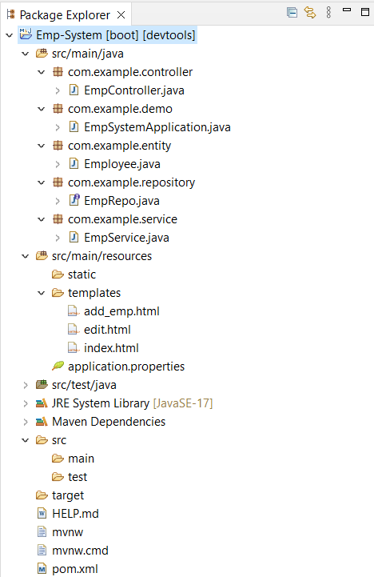

# Employee Management System

# Hi, I'm Ujjawal! 👋

## 🛠 Skills Required for this Project...
Java, HTML, CSS, Spring, Hybernate, MySQL...

## Prerequisite
- [Spring tool suite (STS) IDE](https://spring.io/tools)
- [Mysql Database](https://dev.mysql.com/downloads/installer/)
- [mysql Workbench](https://www.mysql.com/products/workbench/)

## Employee System Project Structure



<summary>EmpSystemApplication.java</summary>

```java
package com.example.demo;

import org.springframework.boot.SpringApplication;
import org.springframework.boot.autoconfigure.SpringBootApplication;

@SpringBootApplication
public class EmpSystemApplication {

	public static void main(String[] args) {
		SpringApplication.run(EmpSystemApplication.class, args);
	}

}

```

<summary>EmpController.java</summary>

```java
package com.example.controller;

import javax.servlet.http.HttpSession;

import org.springframework.beans.factory.annotation.Autowired;
import org.springframework.data.domain.Page;
import org.springframework.stereotype.Controller;
import org.springframework.ui.Model;
import org.springframework.web.bind.annotation.GetMapping;
import org.springframework.web.bind.annotation.ModelAttribute;
import org.springframework.web.bind.annotation.PathVariable;
import org.springframework.web.bind.annotation.PostMapping;

import com.example.entity.Employee;
import com.example.service.EmpService;

@Controller
public class EmpController {

	@Autowired
	private EmpService service;

	@GetMapping("/")
	public String home(Model m) {
		return findPaginated(0, m);
	}

	@GetMapping("/addemp")
	public String addEmpForm() {
		return "add_emp";
	}

	@PostMapping("/register")
	public String empRegister(@ModelAttribute Employee e, HttpSession session) {
		service.addEmp(e);
		session.setAttribute("msg", "Emplyoee Added Sucessfully..");
		return "redirect:/";
	}

	@GetMapping("/edit/{id}")
	public String edit(@PathVariable int id, Model m) {
		Employee e = service.getEMpById(id);
		m.addAttribute("emp", e);
		return "edit";
	}

	@PostMapping("/update")
	public String updateEmp(@ModelAttribute Employee e, HttpSession session) {
		service.addEmp(e);
		session.setAttribute("msg", "Emp Data Update Sucessfully..");
		return "redirect:/";
	}

	@GetMapping("/delete/{id}")
	public String deleteEMp(@PathVariable int id, HttpSession session) {

		service.deleteEMp(id);
		session.setAttribute("msg", "Emp Data Delete Sucessfully..");
		return "redirect:/";
	}

	@GetMapping("/page/{pageno}")
	public String findPaginated(@PathVariable int pageno, Model m) {

		Page<Employee> emplist = service.getEMpByPaginate(pageno, 2);
		m.addAttribute("emp", emplist);
		m.addAttribute("currentPage", pageno);
		m.addAttribute("totalPages", emplist.getTotalPages());
		m.addAttribute("totalItem", emplist.getTotalElements());
		return "index";
	}

}
```

<summary>EmpService.java</summary>

```java
package com.example.service;

import java.util.List;
import java.util.Optional;

import org.springframework.beans.factory.annotation.Autowired;
import org.springframework.data.domain.Page;
import org.springframework.data.domain.PageRequest;
import org.springframework.data.domain.Pageable;
import org.springframework.stereotype.Service;

import com.example.entity.Employee;
import com.example.repository.EmpRepo;

@Service
public class EmpService {

	@Autowired
	private EmpRepo repo;

	public void addEmp(Employee e) {
		repo.save(e);
	}

	public List<Employee> getAllEmp() {
		return repo.findAll();
	}

	public Employee getEMpById(int id) {
		Optional<Employee> e = repo.findById(id);
		if (e.isPresent()) {
			return e.get();
		}
		return null;
	}

	public void deleteEMp(int id) {
		repo.deleteById(id);
	}

	public Page<Employee> getEMpByPaginate(int currentPage, int size) {
		Pageable p = PageRequest.of(currentPage, size);
		return repo.findAll(p);
	}

}

```

<summary>Employee.java</summary>

```java
package com.example.entity;

import javax.persistence.Entity;
import javax.persistence.GeneratedValue;
import javax.persistence.GenerationType;
import javax.persistence.Id;
import javax.persistence.Table;

@Entity
@Table(name = "EMP_SYSTEM")
public class Employee {

	@Id
	@GeneratedValue(strategy = GenerationType.IDENTITY)
	private int id;
	private String name;
	private String address;
	private String email;
	private String phno;
	private int salary;

	public Employee() {
		super();
		// TODO Auto-generated constructor stub
	}

	public int getId() {
		return id;
	}

	public void setId(int id) {
		this.id = id;
	}

	public String getName() {
		return name;
	}

	public void setName(String name) {
		this.name = name;
	}

	public String getAddress() {
		return address;
	}

	public void setAddress(String address) {
		this.address = address;
	}

	public String getEmail() {
		return email;
	}

	public void setEmail(String email) {
		this.email = email;
	}

	public String getPhno() {
		return phno;
	}

	public void setPhno(String phno) {
		this.phno = phno;
	}

	public int getSalary() {
		return salary;
	}

	public void setSalary(int salary) {
		this.salary = salary;
	}

	@Override
	public String toString() {
		return "Employee [id=" + id + ", name=" + name + ", address=" + address + ", email=" + email + ", phno=" + phno
				+ ", salary=" + salary + "]";
	}
}

```

<summary>EmpRepo.java</summary>

```java
package com.example.repository;

import org.springframework.data.jpa.repository.JpaRepository;
import org.springframework.stereotype.Repository;

import com.example.entity.Employee;

@Repository
public interface EmpRepo  extends JpaRepository<Employee, Integer>{

}
```

<summary>index.html</summary>

```html
<!doctype html>
<html lang="en" xmlns:th="http://www.thymeleaf.com">
<head>
<!-- Required meta tags -->
<meta charset="utf-8">
<meta name="viewport"
	content="width=device-width, initial-scale=1, shrink-to-fit=no">

<!-- Bootstrap CSS -->
<link rel="stylesheet"
	href="https://maxcdn.bootstrapcdn.com/bootstrap/4.0.0/css/bootstrap.min.css"
	integrity="sha384-Gn5384xqQ1aoWXA+058RXPxPg6fy4IWvTNh0E263XmFcJlSAwiGgFAW/dAiS6JXm"
	crossorigin="anonymous">

<title>Home page</title>
</head>
<body>

	<!-- Navbar -->


	<nav class="navbar navbar-expand-lg navbar-dark bg-primary">
		<a class="navbar-brand" href="#">EMP System</a>
		<button class="navbar-toggler" type="button" data-toggle="collapse"
			data-target="#navbarSupportedContent"
			aria-controls="navbarSupportedContent" aria-expanded="false"
			aria-label="Toggle navigation">
			<span class="navbar-toggler-icon"></span>
		</button>

		<div class="collapse navbar-collapse" id="navbarSupportedContent">
			<ul class="navbar-nav mr-auto">
				<li class="nav-item active"><a class="nav-link" href="#">Home
						<span class="sr-only">(current)</span>
				</a></li>
				<li class="nav-item active"><a class="nav-link" href="addemp">Add
						EMP</a></li>

			</ul>
		</div>
	</nav>

	<!-- Navbar -->

	<div th:if=${session.msg}>
		<div class="alert alert-success" role="alert" th:text="${session.msg}">
		</div>
		<th:block th:text="${#session.removeAttribute('msg')}"></th:block>
	</div>


	<div class="container p-5">
		<table class="table table-striped" border="1">
			<thead class="bg-primary text-white">
				<tr>
					<th scope="col">Id</th>
					<th scope="col">Name</th>
					<th scope="col">Address</th>
					<th scope="col">Email</th>
					<th scope="col">Phone No</th>
					<th scope="col">Salary</th>
					<th scope="col">Action</th>

				</tr>
			</thead>
			<tbody>
				<tr th:each="e : ${emp}">
					<th th:text="${e.id}">1</th>
					<td th:text="${e.name}"></td>
					<td th:text="${e.address}"></td>
					<td th:text="${e.email}"></td>
					<td th:text="${e.phno}"></td>
					<td th:text="${e.salary}"></td>
					<td><a class="btn btn-sm btn-primary"
						th:href="@{/edit/{id}(id=${e.id})}">Edit</a> <a
						class="btn btn-sm btn-danger"
						th:href="@{/delete/{id}(id=${e.id})}">Delete</a></td>
				</tr>
			</tbody>
		</table>

	</div>

	<div class="container">

		<p>Total Emp: [[${totalItem}]]</p>

		<nav aria-label="Page navigation example">
			<ul class="pagination">
				<li th:if="${currentPage !=0}" class="page-item"><a class="page-link" th:href="@{'/page/'+${currentPage-1}}">Previous</a></li>


				<li th:each="i:${#numbers.sequence(1,totalPages)}"  th:classappend="${currentPage==i-1 ? 'active' : '' }"  class="page-item">
				
				<a class="page-link" th:href="@{'/page/'+${i-1}}">[[${i}]]</a>
				
				
				</li>

				<li th:if="${currentPage+1!=totalPages}" class="page-item"><a class="page-link" th:href="@{'/page/'+${currentPage+1}}">Next</a></li>
			</ul>
		</nav>
	</div>


	<!-- Optional JavaScript -->
	<!-- jQuery first, then Popper.js, then Bootstrap JS -->
	<script src="https://code.jquery.com/jquery-3.2.1.slim.min.js"
		integrity="sha384-KJ3o2DKtIkvYIK3UENzmM7KCkRr/rE9/Qpg6aAZGJwFDMVNA/GpGFF93hXpG5KkN"
		crossorigin="anonymous"></script>
	<script
		src="https://cdnjs.cloudflare.com/ajax/libs/popper.js/1.12.9/umd/popper.min.js"
		integrity="sha384-ApNbgh9B+Y1QKtv3Rn7W3mgPxhU9K/ScQsAP7hUibX39j7fakFPskvXusvfa0b4Q"
		crossorigin="anonymous"></script>
	<script
		src="https://maxcdn.bootstrapcdn.com/bootstrap/4.0.0/js/bootstrap.min.js"
		integrity="sha384-JZR6Spejh4U02d8jOt6vLEHfe/JQGiRRSQQxSfFWpi1MquVdAyjUar5+76PVCmYl"
		crossorigin="anonymous"></script>
</body>
</html>
```

<summary>add_emp.html</summary>

```html
<!doctype html>
<html>
<head>
<!-- Required meta tags -->
<meta charset="utf-8">
<meta name="viewport"
	content="width=device-width, initial-scale=1, shrink-to-fit=no">

<!-- Bootstrap CSS -->
<link rel="stylesheet"
	href="https://maxcdn.bootstrapcdn.com/bootstrap/4.0.0/css/bootstrap.min.css"
	integrity="sha384-Gn5384xqQ1aoWXA+058RXPxPg6fy4IWvTNh0E263XmFcJlSAwiGgFAW/dAiS6JXm"
	crossorigin="anonymous">

<title>Home page</title>
</head>
<body>
	<!-- Navbar -->


	<nav class="navbar navbar-expand-lg navbar-dark bg-primary">
		<a class="navbar-brand" href="#">EMP System</a>
		<button class="navbar-toggler" type="button" data-toggle="collapse"
			data-target="#navbarSupportedContent"
			aria-controls="navbarSupportedContent" aria-expanded="false"
			aria-label="Toggle navigation">
			<span class="navbar-toggler-icon"></span>
		</button>

		<div class="collapse navbar-collapse" id="navbarSupportedContent">
			<ul class="navbar-nav mr-auto">
				<li class="nav-item active"><a class="nav-link" href="#">Home
						<span class="sr-only">(current)</span>
				</a></li>
				<li class="nav-item active"><a class="nav-link" href="addemp">Add
						EMP</a></li>

			</ul>
		</div>
	</nav>

	<!-- Navbar -->
	<div class="container">
		<div class="row">
			<div class="col-md-6 offset-md-3">
				<div class="card">
					<div class="card-body">
						<h4 class="text-center text-primary">Add Emp</h4>

						<form th:action="@{/register}" method="post">

							<div class="form-group">
								<label>Enter Full Name</label> <input type="text"
									class="form-control" name="name">
							</div>

							<div class="form-group">
								<label>Enter Address</label> <input type="text"
									class="form-control" name="address">
							</div>

							<div class="form-group">
								<label>Enter Email</label> <input type="email"
									class="form-control" name="email">
							</div>


							<div class="form-group">
								<label>Enter Phone No</label> <input type="number"
									class="form-control" name="phno">
							</div>


							<div class="form-group">
								<label>Enter Salary</label> <input type="number"
									class="form-control" name="salary">
							</div>

							<button class="btn btn-primary btn-block">Submit</button>
						</form>
					</div>
				</div>
			</div>
		</div>
	</div>
</body>
</html>
```
<summary>edit.html</summary>

```html
<!doctype html>
<html lang="en" xmlns:th="http://www.thymeleaf.com">
<head>
<!-- Required meta tags -->
<meta charset="utf-8">
<meta name="viewport"
	content="width=device-width, initial-scale=1, shrink-to-fit=no">

<!-- Bootstrap CSS -->
<link rel="stylesheet"
	href="https://maxcdn.bootstrapcdn.com/bootstrap/4.0.0/css/bootstrap.min.css"
	integrity="sha384-Gn5384xqQ1aoWXA+058RXPxPg6fy4IWvTNh0E263XmFcJlSAwiGgFAW/dAiS6JXm"
	crossorigin="anonymous">

<title>Home page</title>
</head>
<body>

	<!-- Navbar -->


	<nav class="navbar navbar-expand-lg navbar-dark bg-primary">
		<a class="navbar-brand" href="#">EMP System</a>
		<button class="navbar-toggler" type="button" data-toggle="collapse"
			data-target="#navbarSupportedContent"
			aria-controls="navbarSupportedContent" aria-expanded="false"
			aria-label="Toggle navigation">
			<span class="navbar-toggler-icon"></span>
		</button>

		<div class="collapse navbar-collapse" id="navbarSupportedContent">
			<ul class="navbar-nav mr-auto">
				<li class="nav-item active"><a class="nav-link" href="/">Home
						<span class="sr-only">(current)</span>
				</a></li>
				<li class="nav-item active"><a class="nav-link" href="">Add
						EMP</a></li>

			</ul>
		</div>
	</nav>

	<!-- Navbar -->


	<div class="container">
		<div class="row">
			<div class="col-md-6 offset-md-3">
				<div class="card">
					<div class="card-body">
						<h4 class="text-center text-primary">Edit Emp</h4>

						<form th:action="@{/update}" method="post" th:object="${emp}">

							<input type="hidden" th:value="${emp.id}" name="id">

							<div class="form-group">
								<label>Enter Full Name</label> <input type="text"
									class="form-control" name="name" th:value="${emp.name}">
							</div>

							<div class="form-group">
								<label>Enter Address</label> <input type="text"
									class="form-control" name="address" th:value="${emp.address}">
							</div>

							<div class="form-group">
								<label>Enter Email</label> <input type="email"
									class="form-control" name="email" th:value="${emp.email}">
							</div>


							<div class="form-group">
								<label>Enter Phone No</label> <input type="number"
									class="form-control" name="phno" th:value="${emp.phno}">
							</div>


							<div class="form-group">
								<label>Enter Salary</label> <input type="number"
									class="form-control" name="salary" th:value="${emp.salary}">
							</div>

							<button class="btn btn-primary btn-block">Submit</button>

						</form>
					</div>
				</div>

			</div>
		</div>

	</div>


	<!-- Optional JavaScript -->
	<!-- jQuery first, then Popper.js, then Bootstrap JS -->
	<script src="https://code.jquery.com/jquery-3.2.1.slim.min.js"
		integrity="sha384-KJ3o2DKtIkvYIK3UENzmM7KCkRr/rE9/Qpg6aAZGJwFDMVNA/GpGFF93hXpG5KkN"
		crossorigin="anonymous"></script>
	<script
		src="https://cdnjs.cloudflare.com/ajax/libs/popper.js/1.12.9/umd/popper.min.js"
		integrity="sha384-ApNbgh9B+Y1QKtv3Rn7W3mgPxhU9K/ScQsAP7hUibX39j7fakFPskvXusvfa0b4Q"
		crossorigin="anonymous"></script>
	<script
		src="https://maxcdn.bootstrapcdn.com/bootstrap/4.0.0/js/bootstrap.min.js"
		integrity="sha384-JZR6Spejh4U02d8jOt6vLEHfe/JQGiRRSQQxSfFWpi1MquVdAyjUar5+76PVCmYl"
		crossorigin="anonymous"></script>
</body>
</html>
```


<summary>pom.xml</summary>

```xml
<?xml version="1.0" encoding="UTF-8"?>
<project xmlns="http://maven.apache.org/POM/4.0.0" xmlns:xsi="http://www.w3.org/2001/XMLSchema-instance"
	xsi:schemaLocation="http://maven.apache.org/POM/4.0.0 https://maven.apache.org/xsd/maven-4.0.0.xsd">
	<modelVersion>4.0.0</modelVersion>
	<parent>
		<groupId>org.springframework.boot</groupId>
		<artifactId>spring-boot-starter-parent</artifactId>
		<version>2.7.4</version>
		<relativePath/> <!-- lookup parent from repository -->
	</parent>
	<groupId>com.example</groupId>
	<artifactId>Emp-System</artifactId>
	<version>0.0.1-SNAPSHOT</version>
	<name>Emp-System</name>
	<description>Demo project for Spring Boot</description>
	<properties>
		<java.version>17</java.version>
	</properties>
	<dependencies>
		<dependency>
			<groupId>org.springframework.boot</groupId>
			<artifactId>spring-boot-starter-data-jpa</artifactId>
		</dependency>
		<dependency>
			<groupId>org.springframework.boot</groupId>
			<artifactId>spring-boot-starter-thymeleaf</artifactId>
		</dependency>
		<dependency>
			<groupId>org.springframework.boot</groupId>
			<artifactId>spring-boot-starter-web</artifactId>
		</dependency>

		<dependency>
			<groupId>org.springframework.boot</groupId>
			<artifactId>spring-boot-devtools</artifactId>
			<scope>runtime</scope>
			<optional>true</optional>
		</dependency>
		<dependency>
			<groupId>mysql</groupId>
			<artifactId>mysql-connector-java</artifactId>
			<scope>runtime</scope>
		</dependency>
		<dependency>
			<groupId>org.springframework.boot</groupId>
			<artifactId>spring-boot-starter-test</artifactId>
			<scope>test</scope>
		</dependency>
	</dependencies>

	<build>
		<plugins>
			<plugin>
				<groupId>org.springframework.boot</groupId>
				<artifactId>spring-boot-maven-plugin</artifactId>
			</plugin>
		</plugins>
	</build>

</project>

```
